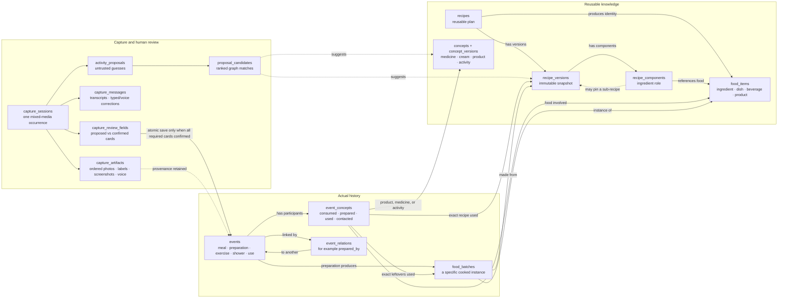

# Pajara

Pajara is a private personal dermatitis tracker for structured capture, AI-assisted
organization, and cautious within-person pattern exploration. It does not diagnose
conditions, establish causes, or advise medication changes.

## Prototype architecture

- `apps/web`: React/Vite PWA deployed to Netlify
- `supabase`: Auth, Postgres migrations, RLS, private Storage, and durable jobs
- `services/python`: FastAPI API with free inline job processing or a separately
  deployable worker for extraction, analysis, reports, and exports
- reusable, versioned medications, treatments, and personal/household products with
  private ingredient-label capture and human-reviewed AI extraction
- mixed photo/label/screenshot/voice Quick Log sessions with ranked private matches,
  explicit card-by-card confirmation, versioned foods and recursively nested recipes,
  and separate ingestion/preparation events
- `packages/schemas`: shared versioned JSON Schemas

## Ontology at a glance



The central distinction is between reusable knowledge and actual occurrences. A recipe
version can contain another exact recipe version, while Tuesday's leftovers are a
`food_batch` attached to Tuesday's preparation event. Ingestion and skin contact are
separate participant roles and are never inferred from recipe membership.

See [the full implementation plan](docs/IMPLEMENTATION_PLAN.md) and
[the deployment runbook](docs/DEPLOYMENT.md). The domain invariants and rationale are in
[the activity and food ontology](docs/ACTIVITY_FOOD_ONTOLOGY.md).

## Local setup

Prerequisites:

- Node.js 22
- Python 3.13
- `uv`
- Docker and the Supabase CLI for the full local stack

Install dependencies:

```sh
make install
```

Copy the example environments:

```sh
cp apps/web/.env.example apps/web/.env
cp services/python/.env.example services/python/.env
```

Start Supabase and apply the migration/seed:

```sh
npx supabase start
npx supabase db reset
```

Use the local credentials printed by Supabase in both `.env` files, then run these in
separate terminals:

```sh
make dev-web
make dev-api
make dev-worker
```

The web app runs at <http://localhost:5173>; the API health endpoint is
<http://localhost:8000/health>.

## Checks

```sh
make check
```

The OpenAI adapter is optional. Keep `EXTRACTION_PROVIDER=fake` for deterministic
local/deployment smoke tests. To test consented remote extraction, set
`EXTRACTION_PROVIDER=openai` and provide `OPENAI_API_KEY` only to the Python API and
worker environment. The production Blueprint defaults to low-cost routing:
`gpt-4.1-mini` for routine text extraction, `gpt-5.4-mini` for photographed product
labels and guided meal/activity capture, and local Moonshine transcription with
`gpt-4o-mini-transcribe` available
only as an explicitly requested backend fallback.
